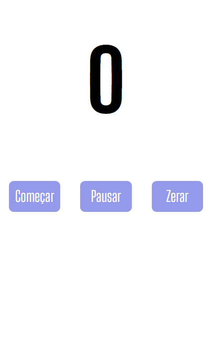

<h1 align="center">Cronômetro</h1>
 
<h3> Esse foi um projeto que eu aprendi no <a href="https://www.devclub.com.br">Dev Club</a></h3>
 
<h2>🚀 Tecnologias Utilizadas</h2>
 
<h3>Este projeto foi desenvolvido com as seguintes tecnologias: </h3>

HTML
 
CSS
 
Java Script

<h3>Mobile:</h3>

<h3>Desktop: </h3>

